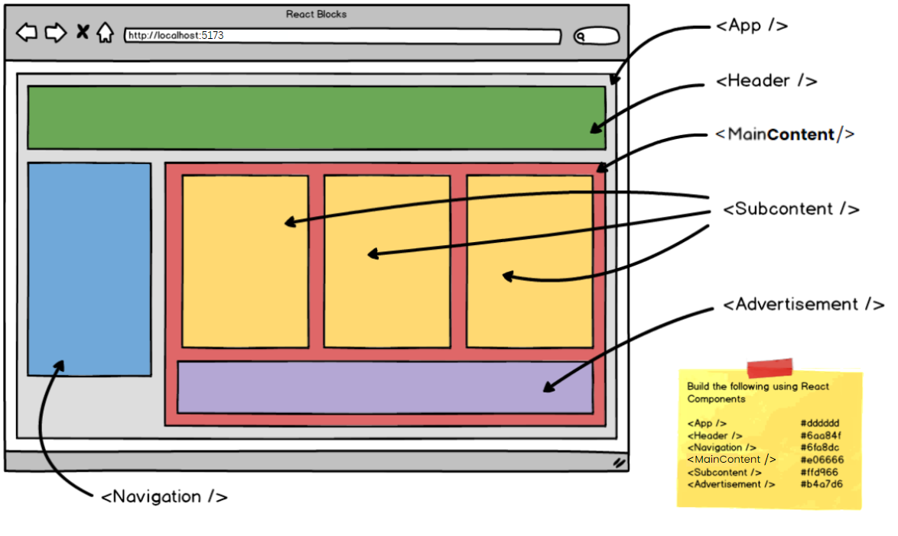

# React Blocks

Tags: Vite Project, components, import styles, inline styles
Objectives: Demonstrate an understanding of functional components and their hierarchical structure.
Section: React.js
Type: Core

<aside>

**💡Create a standard user interface using React components to represent each of the wireframe elements.**

</aside>



- [ ]  Use the terminal to build a new React application with Vite.

---

- [x]  Create a components folder and five additional components for each section of the wireframe.

[](https://github.com/xtina-lt/react-blocks/tree/main/src/components)


---

- [x]  Import the Header, Navigation and MainContent components into the App.jsx.
    
    ## `App.jsx`
    
    [](https://github.com/xtina-lt/react-blocks/blob/main/src/App.jsx)
    
    [](https://github.com/xtina-lt/react-blocks/blob/main/src/components/Header.jsx)
    
    [](https://github.com/xtina-lt/react-blocks/blob/main/src/components/Navigation.jsx)
    
    ```jsx
    import { useState, useEffect } from 'react'
    import logo from './assets/logo.png'
    import './App.css'
    import Header from './components/Header'
    import Navigation from './components/Navigation'
    import MainContent from './components/MainContent'
    
    function App() {
    
      // FUNCTIONS
    
      // WHAT USER SEES
      return (
        <>
          <Header/>
          <div class="container">
            <Navigation/>
            <MainContent/>
          </div>
        </>
      )
    }
    
    export default App
    ```
    

---

- [x]  Import the Advertisement and Subcontent component into the Main.jsx.
    
    ## `MainContent.jsx`
    
    [](https://github.com/xtina-lt/react-blocks/blob/main/src/components/MainContent.jsx)
    
    [](https://github.com/xtina-lt/react-blocks/blob/main/src/components/SubContent.jsx)
    
    [](https://github.com/xtina-lt/react-blocks/blob/main/src/components/Advertisement.jsx)
    
    ```jsx
    import React from 'react'
    import SubContent from './SubContent'
    import Advertisement from './Advertisement'
    import crystal from '../assets/crystal-ball.png'
    import poison from '../assets/poison.png'
    import ghost from '../assets/ghost.png'
    
    const MainContent = () => {
      return (
        <main>
              <SubContent img={crystal}/>
              <SubContent img={poison}/>
              <SubContent img={ghost}/>
            <Advertisement/>
        </main>
      )
    }
    
    export default MainContent
    ```
    

---

- [x]  Clear the default styling from the App.css and the index.css and change layout.
    
    
    

---